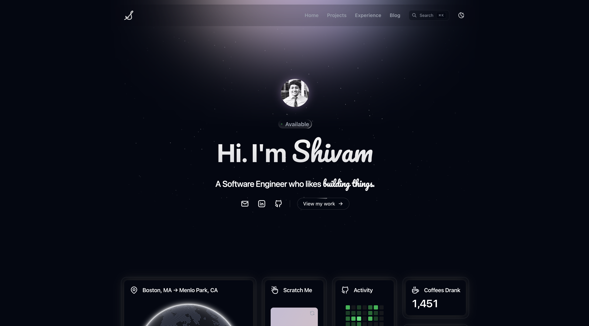

<div align="center">

# Portfolio Website

A modern, animated personal portfolio built with **Next.js 15**, **React 19**, **TypeScript**, and **Tailwind CSS** — featuring live Spotify & WakaTime integrations and a Markdown-powered blog.

[](https://shivypatel.com)
&nbsp;
[](https://github.com/shivy02/portfolio-website/stargazers)
&nbsp;
[](./LICENSE)

**If this project helps or inspires you, please consider leaving a ⭐ — it genuinely helps and motivates me to keep building in the open.**

<br />

[](https://shivypatel.com)

</div>

---

## ✨ Features

- ⚡ **Next.js 15 App Router** + React 19 + TypeScript
- 🎨 **Animated UI** — Framer Motion / Motion, custom Tailwind keyframes (meteors, shimmer, border beam, view transitions)
- 🎧 **Live Spotify integration** — shows my most recently played track
- ⏱️ **Live WakaTime stats** — all-time coding hours, pulled on a schedule
- 📝 **Markdown blog** with syntax highlighting (`rehype-pretty-code` + Shiki)
- 🌗 **Dark mode** by default via `next-themes`
- 🗺️ **Auto-generated sitemap** for SEO

## 🛠️ Tech Stack

| | |
|---|---|
| **Framework** | Next.js 15 (App Router) + React 19 |
| **Language** | TypeScript |
| **Styling** | Tailwind CSS, CSS Modules |
| **Animation** | Framer Motion / Motion, custom keyframes |
| **Content** | Markdown blog via `react-markdown` + `rehype-pretty-code` |
| **Integrations** | Spotify (recently played), WakaTime (coding stats) |
| **Hosting** | Vercel |

## 🚀 Getting Started

```bash
# install dependencies
npm install

# run the development server (http://localhost:3000)
npm run dev

# build for production
npm run build

# run the production build
npm start

# lint
npm run lint
```

Copy `.env.example` to `.env.local` and fill in the required keys (Spotify and WakaTime credentials) to enable the live integrations.

## ⭐ Support

Building and maintaining this in the open takes real time. If you found the code useful, learned something, or are using it as a starting point for your own site:

- **Star the repo** — it's the simplest way to say thanks and helps others discover it.
- **Fork it** and build your own version (see the license terms below).
- Got an idea or found a bug? [Open an issue](https://github.com/shivy02/portfolio-website/issues) — contributions and feedback are welcome.

## 📄 License & Usage

Please read this before reusing anything. This repository is **dual-licensed** (see [`LICENSE`](./LICENSE) for the full text):

- 🟢 **The code is [Apache 2.0](./LICENSE)-licensed.** You're welcome to read it, learn from it, and fork it to build your **own** portfolio.
- 🔴 **The personal content is All Rights Reserved.** My name, bio, photos, logo, blog posts, project write-ups, and other curated assets are **not** covered by the Apache license and may not be reused.

**If you build on this code, please:**

1. Replace all of my personal content with your own.
2. Don't present this site (or a substantially similar copy) as your own work.
3. Apache 2.0 requires you to keep the [`LICENSE`](./LICENSE) and [`NOTICE`](./NOTICE) files, preserve the attribution they contain, and note any files you've changed. A link back to this repo or [my profile](https://github.com/shivy02) is genuinely appreciated. 🙏

If you want to use it in a way the license doesn't cover, just [open an issue](https://github.com/shivy02/portfolio-website/issues) and ask — I'm happy to chat.

---

<div align="center">

Made by [Shivam Patel](https://github.com/shivy02) · If you got this far, drop a ⭐

</div>
